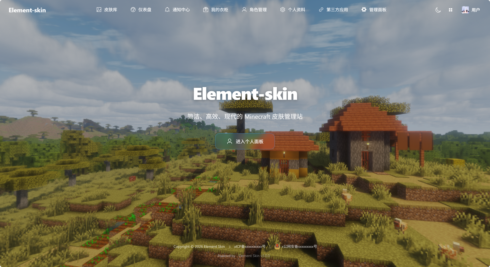

<p align="center">
  
</p>

<p align="center">
  面向高并发场景的现代化外置登录与材质平台
</p>

<p align="center">
  <a href="https://deepwiki.com/water2004/element-skin">
    
  </a>
  <a href="LICENSE">
    
  </a>
  
  
  
  
</p>



## ✨ Element Skin 3.0.0

Element Skin 3.0.0 是一次完整的后端与平台能力升级。后端改用 Go 1.26 实现，在 PostgreSQL 18 和 Redis 的基础上重新整理了请求、业务、数据库与缓存之间的边界；常用公开接口、用户操作、管理操作和 Yggdrasil 请求都经过了新的并发压测。站点 API 统一使用 `/v1`，而 Authlib-Injector、启动器和 Minecraft 服务器依赖的 Yggdrasil 协议路径保持不变，因此两类使用场景可以清晰分开。

用户仍然可以注册、登录、找回密码、管理邮箱、创建角色、上传材质、使用衣柜和预览皮肤，也可以导入 Microsoft 正版角色或远程 Yggdrasil 角色。Microsoft 在这里表示角色导入来源，而不是站点登录账号绑定。导入流程会同时处理角色资料和材质文件，公共皮肤库、材质搜索、角色管理以及 fallback 服务也都可以在统一的站点界面中使用。

3.0.0 的权限系统以权限主体和 Actor 为基础。一个主体可以拥有多个角色，也可以针对单项权限进行覆盖；站点、Yggdrasil、Minecraft 能力和 OAuth 请求都通过同一套细粒度权限规则判断。受保护主体是独立的安全属性，不是绕过权限系统的超级管理员分支；账号封禁也只影响加入 Minecraft 服务器的能力。前端会根据实际权限显示可用页面和操作，最终权限判断仍由后端完成。

平台现在可以作为第三方应用的服务提供方。开发者能够创建公开或机密应用，申请权限、提交审核、轮换密钥并管理应用状态；用户可以通过 Authorization Code + PKCE 或 Device Code 授权，服务端应用可以使用经过审核的 Client Credentials 调用允许的能力。授权撤销、应用停用、密钥轮换和权限变化会联动处理相关 token 与授权记录。仓库同时提供面向 Python 开发者的 OAuth SDK，覆盖授权、设备码、客户端凭据、token 管理和 `/v1` API 调用。

公告、系统消息和 OAuth 事件统一进入通知中心。管理员可以发布短公告或 Markdown 长公告，配置受众、优先级、生效时间和过期时间；应用审核、权限变化、账号封禁等系统事件也会定向通知相关用户。通知中心支持未读提醒、列表浏览、全文查看和忽略，后续增加新的通知类型不需要重新设计公告页面。

fallback 保留原有服务健康检查，同时支持从 Yggdrasil 发现协议和 Services URL 获取并缓存公钥。站点提供 `/v1/minecraft` 能力 API，用于公开角色查询、材质属性读取和服务端加入结果校验，不替代原有 Yggdrasil 协议。首页支持普通背景图和 Minecraft 全景图，配套的媒体管理、动态导航、仪表盘公告列、服务状态自动刷新和节日彩蛋系统也包含在本版本中。

浏览器端使用统一的 localStorage 与 IndexedDB 存储抽象，材质文件、角色卡片和材质卡片的静态渲染结果可以进入带总大小限制的 LRU 缓存；首页的全景媒体、玻璃按钮和响应式布局也针对桌面端与移动端进行了整理。生产部署使用单一 Docker Compose，配置集中写入 `.env`，数据库、Redis、前端静态文件和后端服务可以一起启动。

详细的升级说明请阅读 [`RELEASE.md`](RELEASE.md)，完整的站点 API 请阅读 [Element-Skin v1 API 设计规范](doc/Element-Skin-v1-API设计规范.md)。

---

## 🚀 Docker 部署指南 (推荐)

项目现在默认使用 **PostgreSQL 18 + Redis** 并支持自动化初始化。PostgreSQL 保存用户、设置、材质元数据等持久化数据；Redis 负责公开配置/首页媒体缓存、邮件验证码、限流数据和短期用户鉴权缓存等临时状态。

### 1. 准备 `.env`

Docker 部署只使用仓库根目录的 `docker-compose.yml`。复制 `.env.example` 为 `.env`，然后只修改 `.env`：

```bash
cp .env.example .env
```

必须重点修改这些值：

- `ELEMENT_SKIN_IMAGE`：后端镜像，默认 `ghcr.io/water2004/element-skin:latest`
- `JWT_SECRET`：生产环境随机长密钥
- `DATABASE_PASSWORD` / `REDIS_PASSWORD`：数据库和 Redis 密码
- `SERVER_SITE_URL`：站点外部访问地址
- `SERVER_API_URL`：后端 API 外部访问地址
- `CORS_ALLOW_ORIGINS`：允许访问 API 的前端来源

后端启动时会读取环境变量，并从 `DATABASE_HOST/PORT/USER/PASSWORD/NAME/SSLMODE` 和 `REDIS_HOST/PORT` 派生连接地址。Docker 部署不需要挂载 `config.yaml`，也不维护第二份 Compose 配置。

首次启动时如果 `/app/data/private.pem` 和 `/app/data/public.pem` 不存在，系统会自动生成并保存。请持久化 `./data` 目录，其中 `./data/db` 会挂载到 PostgreSQL 容器的 `/var/lib/postgresql`。后续不要删除或替换私钥，否则已有 Yggdrasil 客户端会看到服务端签名身份变化。

**Nginx 主机配置**
只需将 Nginx 的 `root` 指向宿主机的 `./frontend` 目录。

```nginx
server {
    listen 80;
    server_name yourdomain.com;

    # 1. 前端根目录 (index.html, assets, 以及皮肤 static/)
    root /your/path/to/frontend; 
    index index.html;

    location / {
        add_header X-Authlib-Injector-API-Location "http://yourdomain.com/skinapi" always;
        try_files $uri $uri/ /index.html;
    }

    # 2. 后端 API 转发
    location /skinapi/ {
        proxy_pass http://localhost:8000/;
        proxy_set_header Host $host;
    }
    
    # 直接转发不带斜杠的 API 请求
    location = /skinapi {
        return 308 /skinapi/;
    }
}
```
### 2. 启动服务

拉取镜像并启动：

```bash
docker compose pull
docker compose up -d
```

对于希望前端或后端地址部署在子目录的用户，可以通过 `.env` 灵活配置路径：
- **前端路径**: 通过 `VITE_BASE_PATH` 定义前端资源的基础路径
- **后端路径**: 通过 `VITE_API_BASE` 定义后端 API 的基础路径

根据你的路径需求修改 `.env`，然后重新执行 `docker compose up -d`。前端会根据这些参数在容器启动时替换路径，并自动释放到宿主机的 `./frontend` 目录：

| 场景 | `VITE_BASE_PATH` | `VITE_API_BASE` |
|-----|---------|---------|
| **场景 1** | `/skin/` | `/skinapi` |
| **场景 2** | `/skin/` | `/skin/api/` |

需要注意的是，`.env` 中的 `SERVER_SITE_URL` 和 `SERVER_API_URL` 也需要根据实际部署路径进行调整，以确保生成的链接正确。
当 `VITE_API_BASE` 使用 `/skinapi`、`/skin/api` 这类前缀时，Nginx 的 `proxy_pass` 末尾必须带 `/`，这样会把前缀剥掉再转发给后端。例如 `/skinapi/v1/users/me` 会转成后端实际路由 `/v1/users/me`。

**Nginx 主机配置 (对应场景 1)**
```nginx
# 1. 前端静态文件
location /skin/ {
    add_header X-Authlib-Injector-API-Location "http://yourdomain.com/skinapi" always;
    alias /your/path/to/frontend/;
    index index.html;
    try_files $uri $uri/ /skin/index.html;
}
location = /skin {
    alias /your/path/to/frontend/;
    try_files $uri $uri/ /skin/index.html;
}

# 2. 后端 API 转发
location /skinapi/ {
    proxy_pass http://localhost:8000/;
    proxy_set_header Host $host;
}
location = /skinapi {
    return 308 /skinapi/;
}
```

**Nginx 主机配置 (对应场景 2)**
```nginx
# 1. 前端静态文件
location /skin/ {
    add_header X-Authlib-Injector-API-Location "http://yourdomain.com/skin/api" always;
    alias /your/path/to/frontend/;
    index index.html;
    try_files $uri $uri/ /skin/index.html;
}
location = /skin {
    alias /your/path/to/frontend/;
    try_files $uri $uri/ /skin/index.html;
}

# 2. 后端 API 转发 (嵌套路径)
location /skin/api/ {
    proxy_pass http://localhost:8000/;
    proxy_set_header Host $host;
}
location = /skin/api {
    return 308 /skin/api/;
}
```
---

## 🛠️ 本地开发环境

### 本地开发环境

#### 1. 数据库配置 (PostgreSQL 18+)
本地开发需要手动安装并初始化数据库：

1.  **安装 PostgreSQL**: 确保本地已安装 PostgreSQL 18（或 16+）。
2.  **创建数据库**: 使用 `psql` 或 GUI 工具（如 pgAdmin/DBeaver）创建用户和数据库：
    ```sql
    -- 建议创建专用用户和库
    CREATE USER elementskin WITH PASSWORD 'password123';
    CREATE DATABASE elementskin OWNER elementskin;
    ```
3.  **修改配置**: 编辑 `skin-backend/config.yaml` 中的数据库字段：
    ```yaml
    database:
      host: "localhost"
      port: "5432"
      user: "elementskin"
      password: "password123"
      name: "elementskin"
      sslmode: "disable"
    ```
    > 💡 **自动初始化**: 后端在每次启动时会自动同步数据库结构（创建缺失的表及默认配置），无需手动执行 SQL 脚本。

#### 2. Redis 配置
本地开发需要 Redis 运行在 `127.0.0.1:6379`。如果你的 Redis 设置了密码，请同步修改 `skin-backend/config.yaml`：

```yaml
redis:
  host: "127.0.0.1"
  port: "6379"
  password: ""
  db: 0
  key_prefix: "elementskin:"
```

#### 3. 后端 (Go 1.26+)
```bash
cd skin-backend
go run ./cmd/element-skin
```

#### 4. 前端 (Node.js)
```bash
cd element-skin
npm install
npm run dev
```

---

## 📂 项目结构

```text
element-skin/
├── element-skin/       # 前端源码 (Vue 3 + Element Plus)
├── skin-backend/       # Go 后端源码
│   ├── cmd/            # 进程入口
│   ├── internal/       # HTTP、服务、数据库与测试模块
│   └── config.yaml     # 后端配置文件
├── .env.example        # Docker 部署环境变量模板
├── data/               # Docker 持久化数据 (自动生成)
├── frontend/           # Docker 释放的前端静态文件 (自动生成)
├── docker-compose.yml  
└── README.md
```

## 🧭 当前能力

Element Skin 3.0.0 已经覆盖皮肤站日常使用所需的完整链路：用户注册、登录、邮箱验证、密码找回、角色管理、材质上传、衣柜、3D 预览、公共皮肤库和邀请码注册都可以直接使用。管理员可以分页管理用户、角色、材质、邀请码、官方白名单、站点设置和首页媒体；普通图片与 Minecraft 全景图都可以在后台上传、预览、排序和删除。

对于服务器和启动器，Yggdrasil 认证、刷新、验证、失效、服务器加入、角色查询和材质写入接口保持协议语义，能够继续配合 Authlib-Injector 使用。多个 fallback 服务支持健康检查、角色与材质导入以及公钥聚合；Microsoft 导入和远程 Yggdrasil 导入分别处理正版角色和外部皮肤站角色，不会混淆站点账号体系。

对于站点管理员和第三方开发者，细粒度权限、通知中心和 OAuth 应用系统已经连成一体。管理员可以根据权限主体、角色和单项覆盖精确授权；开发者可以申请公开或机密应用并提交审核；用户可以通过回调授权或设备码授权管理自己的授权；经过审核的服务端应用可以使用 Client Credentials 调用被批准的能力。公告、应用审核结果、权限变化、授权失效和账号封禁等事件都会通过通知系统送达对应用户。

前端提供桌面与移动布局、深色模式、按权限收缩的顶栏、仪表盘服务状态倒计时、公告侧栏、通知未读提醒和统一的 OAuth 授权确认页。首页支持普通图片、Minecraft 全景背景和节日彩蛋；浏览器端的材质与静态渲染缓存使用统一存储抽象，并通过 IndexedDB 的 LRU 策略限制占用空间。

当前仍未纳入 3.0.0 的方向包括国际化、GitHub 等第三方登录、面向移动 App 的专用认证体验，以及云存储或 CDN 材质后端。它们不会影响现有站点、启动器、服务器和第三方应用接口的使用。

---

## 🧪 自动化测试

Go 后端采用分层测试架构，确保从底层数据库到顶层 API 的稳定性。

### 测试架构
1.  **数据库层 (`internal/database`)**: 验证 SQL 逻辑、数据迁移及缓存一致性。
2.  **业务逻辑层 (`internal/service`)**: 验证核心业务规则（如注册权限、材质级联更新）。
3.  **HTTP 集成层 (`internal/integration`)**: 使用真实 PostgreSQL 和真实 Redis，模拟真实 HTTP 请求。

### 运行测试
测试会自动创建临时数据库和文件目录，不会影响本地开发数据。

```bash
cd skin-backend
go test ./...
```

### 编写新测试
单元测试使用内存 Redis mock；`internal/integration` 使用真实 Redis，并通过唯一 key 前缀自动清理测试数据，不会清空你的本地 Redis。

## 📈 并发压测结果

最新一次 v3.0.0 压测在本机通过 `skin-backend/cmd/loadtest` 启动隔离测试数据库、真实 Redis key 前缀和进程内 HTTP 服务完成，不会触碰正常运行数据库。命令如下：

```bash
cd skin-backend
LOADTEST_ENABLE=1 LOADTEST_CONCURRENCY=200 LOADTEST_DURATION=1s go test ./cmd/loadtest -run TestRealBackendLoad -count=1 -v
```

测试数据：100 个用户、300 个角色、500 条材质记录、50 个邀请码、1 个预置 Yggdrasil join 会话。固定并发：200；每个场景窗口：1s；数据库连接池：20。当前报告包含公开端点、Cookie、OAuth delegated、Client Credentials、管理员和 Yggdrasil 场景，全部 0 失败。

### v3.0.0 与 v2.4.1 功能对照

下表比较的是同一业务功能在两个版本中的实际接口，不是 Go 与 Python 实现语言对比。v2.4.1 基准取自 Python 2.4.1 压测，v3.0.0 基准取自本次 Go 压测；v2.4.1 使用旧站点路径，v3.0.0 使用 `/v1` 路径，Yggdrasil 协议路径保持不变。

| 功能（v2.4.1 → v3.0.0） | v3.0.0 req/s | v2.4.1 req/s | 变化 | v3.0.0 P95 | v2.4.1 P95 |
| --- | ---: | ---: | ---: | ---: | ---: |
| 公开设置（`/public/settings` → `/v1/public/settings`） | 26733.6 | 1913.7 | 14.0x | 8.4ms | 200.3ms |
| 首页媒体（`/public/homepage-media` → `/v1/public/homepage-media`） | 32634.7 | 2138.0 | 15.3x | 7.8ms | 113.4ms |
| 公开皮肤库（`/public/skin-library` → `/v1/public/skin-library`） | 18196.2 | 777.9 | 23.4x | 16.1ms | 552.6ms |
| 登录（`/site-login` → `/v1/auth/login`） | 311.7 | 42.1 | 7.4x | 890.7ms | 4.58s |
| Yggdrasil 元数据（`/` → `/`） | 26109.0 | 2694.4 | 9.7x | 10.2ms | 110.9ms |
| Yggdrasil authenticate | 289.6 | 42.6 | 6.8x | 1.11s | 4.54s |
| Yggdrasil validate | 16188.3 | 1126.3 | 14.4x | 13.9ms | 422.1ms |
| Yggdrasil profile | 70172.7 | 1782.7 | 39.4x | 4.6ms | 151.1ms |
| Yggdrasil 按名称查询 | 75233.8 | 1827.5 | 41.2x | 4.2ms | 164.2ms |
| Yggdrasil hasJoined | 1976.9 | 250.8 | 7.9x | 158.5ms | 1.36s |
| 当前用户（`/me` → `/v1/users/me`） | 12896.7 | 984.3 | 13.1x | 18.7ms | 384.1ms |
| 我的角色（`/me/profiles` → `/v1/users/me/profiles`） | 17094.2 | 891.2 | 19.2x | 13.4ms | 469.3ms |
| 我的材质（`/me/textures` → `/v1/users/me/textures`） | 17070.5 | 1125.8 | 15.2x | 13.6ms | 361.6ms |
| 材质详情（`/me/textures/{hash}/skin` → `/v1/users/me/textures/{hash}/skin`） | 16641.1 | 1101.1 | 15.1x | 13.8ms | 360.5ms |
| 管理员用户列表（`/admin/users` → `/v1/admin/users`） | 1879.5 | 672.9 | 2.8x | 124.8ms | 780.4ms |
| 管理员用户详情（`/admin/users/{id}` → `/v1/admin/users/{id}`） | 12154.6 | 822.2 | 14.8x | 19.4ms | 510.3ms |
| 管理员用户角色列表（`/admin/users/{id}/profiles` → `/v1/admin/users/{id}/profiles`） | 16390.8 | 1032.5 | 15.9x | 13.8ms | 689.5ms |
| 管理员角色列表（`/admin/profiles` → `/v1/admin/profiles`） | 14260.2 | 809.2 | 17.6x | 17.0ms | 822.5ms |
| 管理员材质列表（`/admin/textures` → `/v1/admin/textures`） | 14997.6 | 793.0 | 18.9x | 17.0ms | 659.7ms |
| 管理员邀请码（`/admin/invites` → `/v1/admin/invites`） | 14821.4 | 915.9 | 16.2x | 16.0ms | 371.8ms |
| 管理员站点设置（`/admin/settings/site` → `/v1/admin/settings/site`） | 2607.6 | 1318.3 | 2.0x | 80.8ms | 890.1ms |

这组对比只能说明固定测试条件下的吞吐和延迟差异，不能把路径迁移本身当作性能原因。3.0.0 额外增加了细粒度权限、Redis 权限缓存和统一 Actor 处理，因此当前用户和管理员列表等复杂权限路径需要重点关注。

### v3.0.0 新增 OAuth 压测场景

v2.4.1 没有对应 OAuth 功能，因此以下场景不参与跨版本对比：

| 场景 | 接口 | 成功 req/s | P95 |
| --- | --- | ---: | ---: |
| OAuth delegated 当前用户 | `/v1/users/me` | 9588.1 | 28.1ms |
| OAuth delegated 角色列表 | `/v1/users/me/profiles` | 13213.5 | 18.9ms |
| OAuth delegated 材质列表 | `/v1/users/me/textures` | 11809.0 | 23.5ms |
| OAuth delegated 材质详情 | `/v1/users/me/textures/{hash}/skin` | 13124.8 | 19.1ms |
| OAuth delegated 管理员用户列表 | `/v1/admin/users` | 1712.3 | 136.3ms |
| OAuth delegated 管理员用户详情 | `/v1/admin/users/{id}` | 9374.1 | 29.7ms |
| OAuth delegated 管理员邀请码 | `/v1/admin/invites` | 11404.4 | 22.5ms |
| Client Credentials 管理员邀请码 | `/v1/admin/invites` | 6709.2 | 42.1ms |
| OAuth delegated 管理员设置 | `/v1/admin/settings/site` | 2525.0 | 83.0ms |

完整报告见 [`reports/concurrency-load-test.md`](reports/concurrency-load-test.md)。压测报告使用隔离 PostgreSQL 数据库和 Redis key 前缀，测试结束后自动清理测试数据。

## 📄 许可证

[MIT License](LICENSE)
